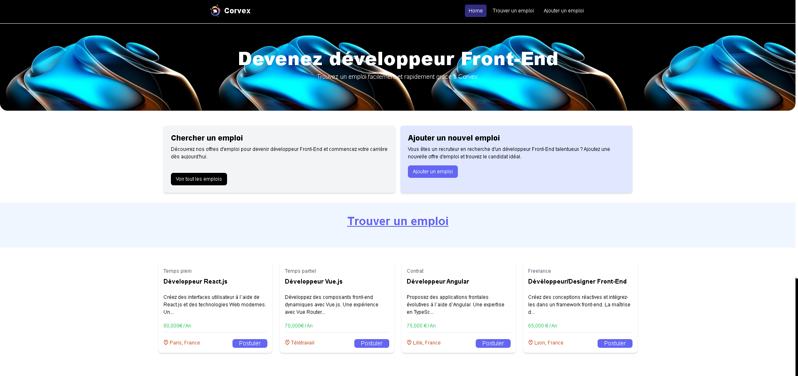
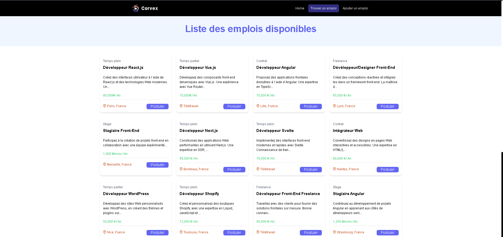
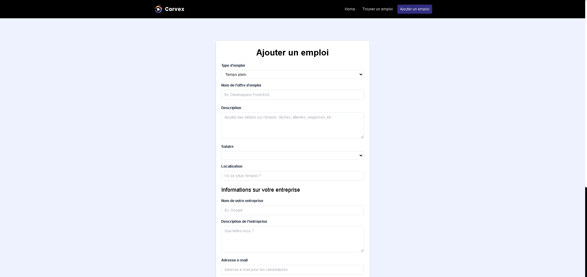

# 🌟 Corvex - Front-End Job Finder Platform

<div align="center">
  
</div>

Corvex is a sleek and modern job platform tailored specifically for Front-End developers. Built with **Vue.js 3** and **Tailwind CSS**, it connects job seekers and employers in the front-end development community with a user-friendly interface and powerful search tools.

---

## 🚀 Features

✅ **Job Listings:** Browse curated front-end positions  
✅ **Job Management:** Create, edit, and delete job postings  
✅ **Real-time Search:** Quickly filter jobs with dynamic criteria  
✅ **Responsive Design:** Optimized for mobile, tablet, and desktop  
✅ **Toast Notifications:** Interactive feedback for user actions  
✅ **Modern UI:** Clean, professional interface powered by Tailwind CSS

---

## 📸 Screenshots

### 🏠 Home Page

  
_Welcoming interface with featured job listings._

### 📄 Job Listings

  
_Easily browse through available front-end positions._

### ✍️ Add/Edit Job

  
_Seamless interface for creating and managing job listings._

---

## 🛠️ Technical Stack

| **Technology**          | **Usage**                   |
| ----------------------- | --------------------------- |
| **Vue.js 3**            | Frontend Framework          |
| **Vue Composition API** | State Management            |
| **Tailwind CSS**        | Styling & Responsive Design |
| **Vue Router**          | Client-side Routing         |
| **Axios**               | HTTP Client                 |
| **JSON Server**         | Mock Backend API            |
| **Vue Toastification**  | Notifications               |
| **PrimeIcons**          | Icon Library                |
| **Vite**                | Build Tool & Dev Server     |

---

## 🚀 Project Setup

```bash
# Install dependencies
npm install

# Start the mock API server
npm run server

# Run development server
npm run dev

# Build for production
npm run build

# Preview the production build
npm run preview
```

---

## ⚙️ Configuration Files

- `vite.config.js`: Development server & proxy settings
- `tailwind.config.js`: Custom Tailwind configurations
- `postcss.config.js`: PostCSS plugins setup
- `jsconfig.json`: Path aliases for simplified imports

---

## 📂 Project Structure

```plaintext
src/
├── assets/         # Static assets (images, fonts)
├── components/     # Reusable Vue components
├── router/         # Vue Router configurations
├── views/          # Page components (Home, Jobs, Add/Edit Job)
├── App.vue         # Root component
└── main.js         # Application entry point
```

---

## 🔌 API Integration (JSON Server)

The application uses **JSON Server** to simulate API endpoints:

| **Endpoint**    | **Method** | **Description**        |
| --------------- | ---------- | ---------------------- |
| `/api/jobs`     | GET        | Fetch all job listings |
| `/api/jobs/:id` | GET        | Fetch specific job     |
| `/api/jobs`     | POST       | Create a new job       |
| `/api/jobs/:id` | PUT        | Update existing job    |
| `/api/jobs/:id` | DELETE     | Delete a job posting   |

---

## 🎨 UI Components Overview

✨ **Hero Section:** Welcoming banner with featured jobs  
🗂️ **Job Cards:** Compact cards displaying job details  
🔍 **Search Bar:** Dynamic filtering of job listings  
📱 **Responsive Navigation:** Seamless on all devices  
📝 **Forms:** Create and edit job postings with ease  
🔔 **Toast Notifications:** Real-time user feedback

---

## 🌍 Browser Compatibility

✅ Chrome (latest)  
✅ Firefox (latest)  
✅ Safari (latest)  
✅ Edge (latest)

---

## 📜 License

This project is licensed under the [MIT License](LICENSE).

---

## 🤝 Contributing

Contributions are welcome! Follow these steps:

```bash
# 1️⃣ Fork the repository
# 2️⃣ Create your feature branch
git checkout -b feature/AmazingFeature

# 3️⃣ Commit your changes
git commit -m 'Add AmazingFeature'

# 4️⃣ Push to the branch
git push origin feature/AmazingFeature

# 5️⃣ Open a Pull Request 🚀
```

---

## 💬 Support

For issues or questions, feel free to [open an issue](https://github.com/yourusername/corvex/issues) on GitHub.

---

<div align="center">
  Made with ❤️ by Michel
</div>
